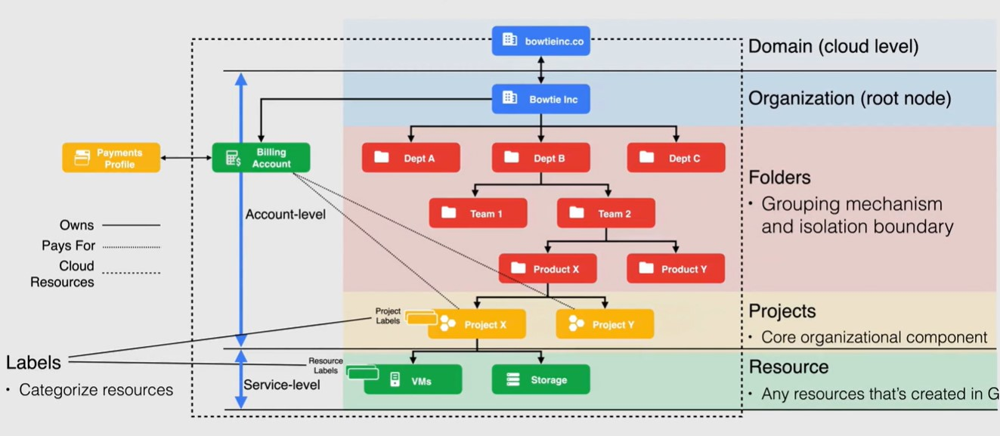

js

Youtube : Andrew - https://www.youtube.com/watch?v=jpno8FSqpc8&t=3674s

https://app.exampro.co/

# Characteristics

a. Ondemand self service - automatic creation(minimal efforts)

b. Broad NW access - avaialble on NW

c. Resource pooling  -  Multiple customers can / should share resources with a secuirty.

Ex : ppl living in an apartment but security will be there for their home

d. Rapic elasticity

e. Measured service  (monitoirng and alerting)

# Cloud deployment models

public (1 public cloud), private (on-prem cloud)), multi-cloud (2 or more public cloud),

hybrid cloud - (private cloud+public clud)

Hybrid cloud and Hybrid environments are both different.

# Cloud Service Models (XaaS)

IaaS: IaaS businesses offer services such as pay-as-you-go storage,
networking, and virtualization. IaaS gives users cloud-based
alternatives to on-premise infrastructure, so businesses can avoid
investing in expensive on-site resources.

PaaS: A PaaS vendor provides hardware and software tools over the
internet, and people use these tools to develop applications. PaaS users
 tend to be developers.

SaaS: SaaS platforms make software available to users over the internet, usually for a monthly subscription fee.

On-premise: software that’s installed in the same building as your business.

# Google Cloud Global Infrastructure

**Geography and Regions**

**Zone**

* A zone is a deployment area for Google Cloud resources within a region.
* The smallest entity in Google’s global network.
* A single failure domain within a region
* Deploy closer to users for optimal latency

**Region**

* Regions are independent geographic areas that are sub-divided into zones
* For fault tolerance and high availability
* Intercommunication <5ms between zones within a region

**Multi-Region**

* Multi-Regions are large geographic areas, that contain two or more regions
* Allows Google services to maximize redundancy and distribution within and across regions
* High availability (geo-redundant)

# Compute Service Options

IaaS - VM Instances

CaaS - GKE - Kubernetes Engine (Container as a service)

PaaS -  App engine

FaaS - Cloud functions, Function as a servie

FaaS - Serverless for Containers -- Cloud Run - Fully managed compute platform for containerized apps. Built ok Knative

**Compute Engine**

* Virtual Machines (VMs) called instances, Choose region and zone to
  deploy , You decide the operating system and the software you decide to
  put on it
* Use public or private images to create instances
* Pre-configured images and software packages available in Google Cloud Marketplace
* Manage multiple instances using instance groups
* Add/remove capacity using autoscaling with instance groups
* Attach/detach disks as needed
* Can be used with Google Cloud Storage
* Use SSH to connect directly
* Considered to be IaaS

**Google Kubernetes Engine (GKE)**

* Container-orchestration system for automating deploying, scaling, and managing containers
* Built on open-source Kubernetes
* Flexibility to integrate with on-premise Kubernetes
* Uses Compute Engine instances as nodes in a cluster.
* A cluster is a group of nodes or Compute Engine instances
* Considered Container as a Service (CaaS)

**App Engine**

* Fully managed, serverless platform for developing and hosting web applications at scale (PaaS)
* Provisions servers and scales your app instances based on demand
* Build your app in Go, Java, .NET, Node.js, PHP, Python, or Ruby
* Connect with other Google services seamlessly
* Integrates with Web Security Scanner to identify threats

**Cloud Functions**

* Serverless execution environment for building and connecting cloud services
* Simple, single-purpose functions that are attached to events
* Triggered when an event being watched is fired
* Your code executes in a fully managed environment
* No need to provision any infrastructure
* Cloud Functions can be written using JavaScript, Python 3, Go, or Java runtimes

**Cloud Run**

* Fully managed compute platform for deploying and scaling containerized applications quickly and securely
* Built upon an open standard Knative
* Abstracts away all infrastructure management
* Known as serverless for containers
* Any language, any library, any binary
* Considered Function as a service(FaaS)

# Storage and Database Options

**Cloud Storage**

* Consistent, scalable, large-capacity, highly durable object storage
* 11 9’s Durability (99.999999999%)
* Unlimited storage with no minimum object size
* Use Cloud Storage for content delivery, data lakes, and backup
* Available in different storage classes and availability

**Storage Classes**

**Standard**

* Maximum availability and no limitations

**Nearline**

* Low-cost archival storage
* Accessed <1/month

**Coldline**

* Even lower-cost archival storage
* Accessed <1/quarter

**Archive**

* Lowest-cost archival storage
* Accessed <1/year

**Availability**

**Region**

* Single Region

**Dual-region**

* Pair of regions

**Multi-region**

* Large geographic area

**Filestore**

* Fully managed NFS file server
* NFSv3 compliant
* Store data from running applications
* Use with VM instances and Kubernetes clusters

**Persistent Disks**

* Durable block storage for instances
* Standard – Regular standard storage at a reasonable price
* Solid State (SSD) - Lower latency/higher IOPS

Both options are available in zonal and regional options

### Relational

#### Cloud SQL

* Fully managed database service
* PostgreSQL, MySQL, and SQL Server
* High availability across zones

#### Cloud Spanner

* Scalable relational database service
* Support transactions, strong consistency and synchronous replication
* High availability across regions and globally

#### Bare Metal Solution for Oracle (NEW)

* Lift and shift Oracle workloads to Google Cloud

### Key-value

No-SQL - Bigtable, Datastore, Firestore and Memorystore

#### Cloud Bigtable

* Fully managed, scalable NoSQL database
* High throughput with low latency
* Cluster resizing without downtime

#### BigQuery (NEW)

* Serverless, highly scalable, cost-effective multicloud data warehouse
* designed for business agility
* 99.99% availability

**Datastore**

* Fast, fully managed, serverless, NoSQL document database
* For mobile, web and IoT apps
* Multi-region replication and ACID transactions

### Document

#### Firestore

* NoSQL, realtime database
* Optimized for offline use
* Cluster resizing without downtime

#### Firebase Realtime Database (NEW)

* Store and sync data in real time

### In-memory

#### Memorystore

* Highly available in-memory service for Redis and Memcached
* Fully Managed

# Networking Services

**Virtual Private Cloud (VPC)**

* Virtualized network within Google Cloud
* Core networking service
* Global resource
* Each VPC contains a default network
* Additional networks can be created in your project, but networks cannot be shared between projects.

**Firewall Rules**

* Govern traffic coming into instances on a network
* The Default network has a default set of firewall rules
* Custom rules can be created

**Routes**

* Advanced networking functions for your instances
* Specifies how packets leaving an instance should be directed

**Load Balancing**

* Distributing Workloads across multiple instances

**HTTP(S) Load Balancing**

* Distribute traffic across regions to ensure that requests are routed to the closest region or, in the event of a failure or over-capacity, to a healthy instance in the next closest region.
* Distribute traffic based on the content type

**Network Load Balancing**

* Distribute traffic among server instances in the same region based on incoming IP protocol data, such as an address, port, and protocol

**Google Cloud DNS**

* Publish and maintain DNS records by using the same infrastructure that Google uses.
* Work with managed zones and DNS records through the CLI, API, or SDK

**Cloud VPN**

* Connect your existing network to your VPC through an IPsec connection.

**Direct Interconnect**

* Connect an existing network to your VPC using a highly available, low-latency, enterprise-grade connection.

**Direct Peering**

* Exchange internet traffic between your business network and Google at one of Google's broad-reaching edge network locations

**Carrier Peering**

* Connect your infrastructure to Google's network edge through highly available, lower-latency connections by using service providers

# Resource Hierarchy

**Service-level resources**

* Compute Instance VM’s
* Cloud Storage buckets
* Cloud SQL databases

**Account-level resources**

* Organization
* Folders
* Projects

**Resource Hierarchy**

* Configure and grant access to the various resources
* Resource Hierarchy Structure
* Resources are organized hierarchically using a parent/child relationship
* Designed to map organizational structure to Google Cloud
* Better management of permissions and access control
* Policies controlled by IAM
* Access control policies and configuration settings on a parent resource are inherited by the child
* Each child object has exactly one parent.

**Domain (cloud level)**

**Organization (root node)**

**Folders**

* Grouping mechanism and isolation boundary

**Projects**

* Core organizational component

**Resources**

* Any service-level resource

**Labels**

* Categorize resources

# Final
