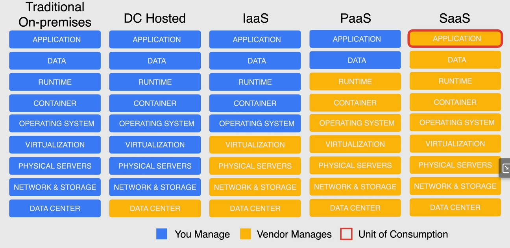

js

# Characteristics

a. Ondemand self service - automatic creation(minimal efforts)

b. Broad NW access - avaialble on NW

c. Resource pooling  -  Multiple customers can / should share resources with a secuirty.

Ex : ppl living in an apartment but security will be there for their home

d. Rapic elasticity

e. Measured service  (monitoirng and alerting)

# Cloud deployment models

public (1 public cloud), private (on-prem cloud)), multi-cloud (2 or more public cloud),

hybrid cloud - (private cloud+public clud)

Hybrid cloud and Hybrid environments are both different.

# Cloud Service Models (XaaS)

IaaS: IaaS businesses offer services such as pay-as-you-go storage,
networking, and virtualization. IaaS gives users cloud-based
alternatives to on-premise infrastructure, so businesses can avoid
investing in expensive on-site resources.

PaaS: A PaaS vendor provides hardware and software tools over the
internet, and people use these tools to develop applications. PaaS users
 tend to be developers.

SaaS: SaaS platforms make software available to users over the internet, usually for a monthly subscription fee.

On-premise: software that’s installed in the same building as your business.

# Google Cloud Global Infrastructure

**Geography and Regions**

**Zone**

* A zone is a deployment area for Google Cloud resources within a region.
* The smallest entity in Google’s global network.
* A single failure domain within a region
* Deploy closer to users for optimal latency

**Region**

* Regions are independent geographic areas that are sub-divided into zones
* For fault tolerance and high availability
* Intercommunication <5ms between zones within a region

**Multi-Region**

* Multi-Regions are large geographic areas, that contain two or more regions
* Allows Google services to maximize redundancy and distribution within and across regions
* High availability (geo-redundant)

# Compute Service Options

IaaS - VM Instances

CaaS - GKE - Kubernetes Engine (Container as a service)

PaaS -  App engine 

FaaS - Cloud functions, Function as a servie 

FaaS - Serverless for Containers -- Cloud Run - Fully managed compute platform for containerized apps. Built ok Knative

**Compute Engine**

* Virtual Machines (VMs) called instances, Choose region and zone to
  deploy , You decide the operating system and the software you decide to
  put on it
* Use public or private images to create instances
* Pre-configured images and software packages available in Google Cloud Marketplace
* Manage multiple instances using instance groups
* Add/remove capacity using autoscaling with instance groups
* Attach/detach disks as needed
* Can be used with Google Cloud Storage
* Use SSH to connect directly
* Considered to be IaaS

**Google Kubernetes Engine (GKE)**

* Container-orchestration system for automating deploying, scaling, and managing containers
* Built on open-source Kubernetes
* Flexibility to integrate with on-premise Kubernetes
* Uses Compute Engine instances as nodes in a cluster.
* A cluster is a group of nodes or Compute Engine instances
* Considered Container as a Service (CaaS)

**App Engine**

* Fully managed, serverless platform for developing and hosting web applications at scale (PaaS)
* Provisions servers and scales your app instances based on demand
* Build your app in Go, Java, .NET, Node.js, PHP, Python, or Ruby
* Connect with other Google services seamlessly
* Integrates with Web Security Scanner to identify threats

**Cloud Functions**

* Serverless execution environment for building and connecting cloud services
* Simple, single-purpose functions that are attached to events
* Triggered when an event being watched is fired
* Your code executes in a fully managed environment
* No need to provision any infrastructure
* Cloud Functions can be written using JavaScript, Python 3, Go, or Java runtimes

**Cloud Run**

* Fully managed compute platform for deploying and scaling containerized applications quickly and securely
* Built upon an open standard Knative
* Abstracts away all infrastructure management
* Known as serverless for containers
* Any language, any library, any binary
* Considered Function as a service(FaaS)

# Final
